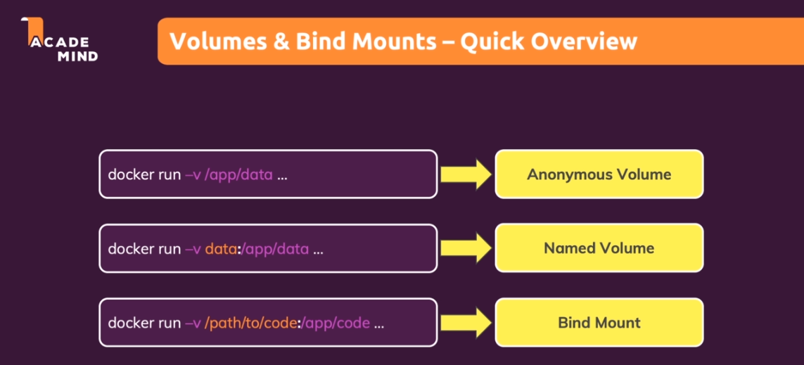

In Docker, a "volume" refers to a mechanism for persisting and managing data separate from the containers that use them. Volumes are an essential component for managing data in Docker containers, as they offer several advantages:

1. **Data Persistence:** Containers are ephemeral by nature, and any data created or modified within a container is typically lost when the container stops or is removed. Volumes allow you to persist data across container lifecycles, ensuring data durability.

2. **Isolation:** Volumes provide a level of isolation between containers. Multiple containers can share the same volume, making it easy to centralize and share data among related services or containers.

3. **Performance:** Volumes can offer better I/O performance compared to writing data directly to a container's filesystem. This is because volume data is often stored on the host's filesystem.

4. **Ease of Backup and Migration:** Volumes can be easily backed up, moved, or migrated, simplifying data management and disaster recovery.

5. **Customization:** Docker volumes are flexible and can be configured to use different types of storage backends, such as local filesystems, network-attached storage, or cloud storage solutions.

To create and use a volume in Docker, you can use the following Docker commands:

- `docker volume create <volume_name>`: This command creates a named volume.
- `docker run -v <volume_name>:<container_path>`: This command mounts a volume into a container at a specified path.
- `docker run -v /host/path:/container/path`: You can also mount host directories as volumes in a container.
- `docker volume ls`: Lists all the available volumes on your Docker host.
- `docker volume rm <volume_name>`: Removes a named volume.

Volumes make it easier to manage and handle data in Docker containers, and they are a critical component for containerized applications that need to work with persistent data.

**Bind Mounts in Docker:**

Bind mounts in Docker are a method for sharing files or directories between a Docker container and the host system. With bind mounts, you can link specific files or directories on your host machine to corresponding locations within the container. This allows data to be easily shared and synchronized between the host and container.

**Bind Mounts vs. Volumes:**

Bind mounts and volumes serve similar purposes in Docker, but there are some key differences between the two:

1. **Data Persistence:**
   - **Bind Mounts:** Data stored using bind mounts is directly on the host filesystem. It is not managed by Docker and remains even if the container is removed.
   - **Volumes:** Docker-managed volumes are isolated from the host filesystem. They provide better data management, backup, and portability. Volumes are typically managed by Docker and are more suitable for persisting data between containers and across different environments.

2. **Performance:**
   - **Bind Mounts:** Generally, bind mounts can have better performance for I/O operations since they interact directly with the host filesystem.
   - **Volumes:** Volumes may introduce a slight performance overhead due to Docker's management layer.

3. **Ease of Use:**
   - **Bind Mounts:** They are easier to set up and understand, making them convenient for quick development and testing.
   - **Volumes:** Docker volumes offer more features and control, but they might be considered more complex for simple use cases.

4. **Portability:**
   - **Bind Mounts:** Less portable because they depend on the host's directory structure.
   - **Volumes:** More portable as Docker manages them, allowing easier migration between different environments or hosts.




___

You can add more "**to-be-ignored**" files and folders to your `.dockerignore` file.

For example, consider adding the following to entries:

```
Dockerfile
.git
```

This would ignore the `Dockerfile` itself as well as a potentially existing `.git` folder (if you are using Git in your project).

In general, you want to add anything which isn't required by your application to execute correctly.

